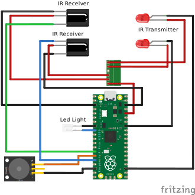

# LeTrack

LeTrack is a race tracking system that uses IR break beam sensors to detect lap events.

This project consist of 3 parts.

- Dotnet Back end (api)
- Svelte Front end (fe)
- Hardware sensors (sensor)

## UI Screenshots


## Back End

### Run Back End

```bash
# Start back end containers first
docker compose up -d
dotnet run
```

## Front End

### Run Front End

```bash
# Run back end first
pm dev
```

## Assets


This consist of two parts. The front and the back. It has slots for all required components to go in.

- [Back](./assets/LeTrack-Back.stl)
- [Front](./assets/LeTrack-Front.stl)

### 3D Model Additional Parts

- 6x M2 screws to fit the raspberry pi and the speaker.
- 4x M3 Screws for the corners

## Hardware / Sensor

This is a micropython project that needs the below components:

- IR break beam sensors
- Active Buzzer
- Raspberry Pi Pico W



### DEV Setup

1. Install micropython on raspberry pi
2. Setup virtual environment for python and install requirements
3. Use rshell to do the rest
4. Install packages using mip
5. Create config.py based on example-config.py

### Setup Virtual Environment

```bash
# Setup venv
python3 -m venv venv
source venv/bin/activate
# Install requirements
pip install -r requirements.txt
```

### shell

```bash
rshell
rshell ls
rshell
# ctrl-x seems to close repl
ls /pyboard

rshell repl
# sync src with pyboard
rshell rsync sensor /pyboard

# run specific file in repl
exec(open('test.py').read())
```

### Install Packages

```bash
# Install mip packages
rshell
repl
import mip
mip.install('umqtt.simple')
```

## Emulate Events From Bash

```bash
mqttui publish "event" '{ "Id": "'$(uuidgen)'", "TrackId": '$((RANDOM % 2 + 1))', "Timestamp": "'$(date -u +"%Y-%m-%dT%H:%M:%SZ")'"}'
```